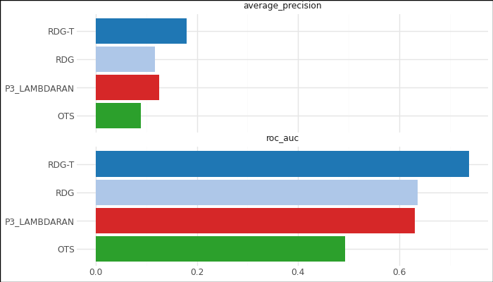
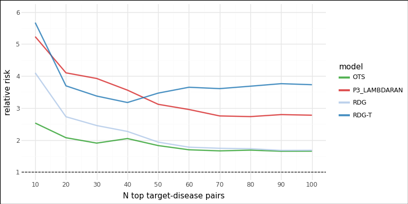
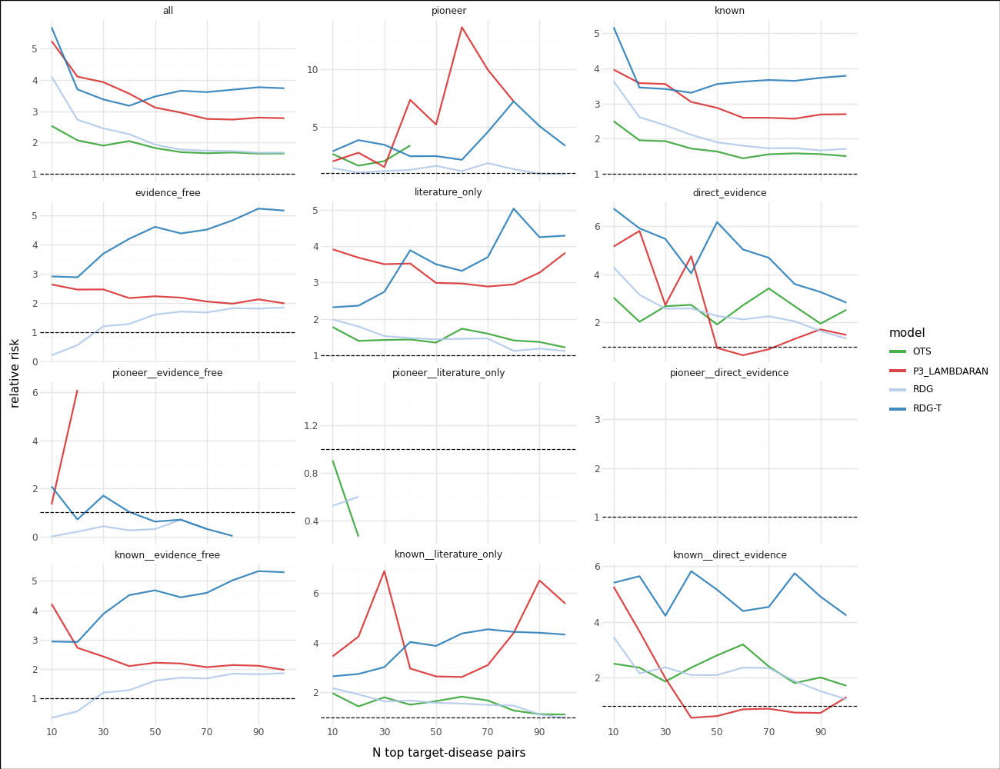
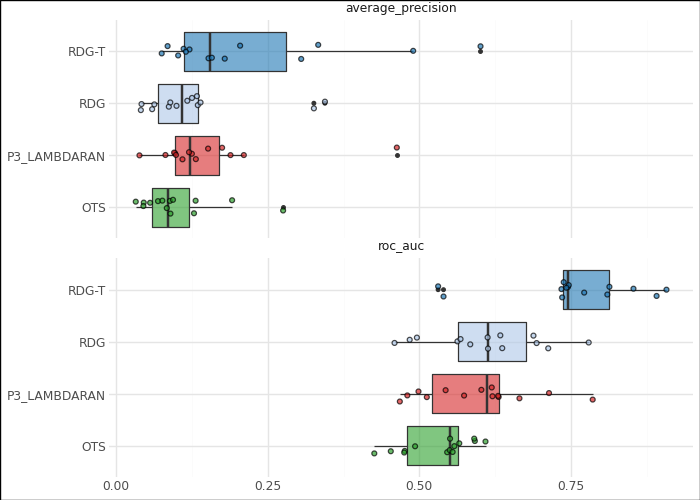
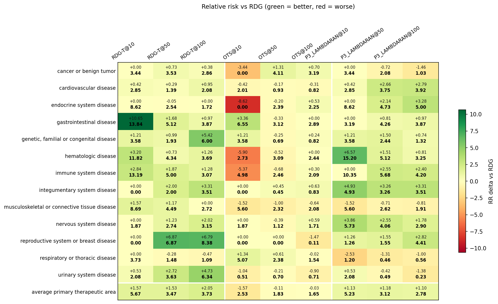
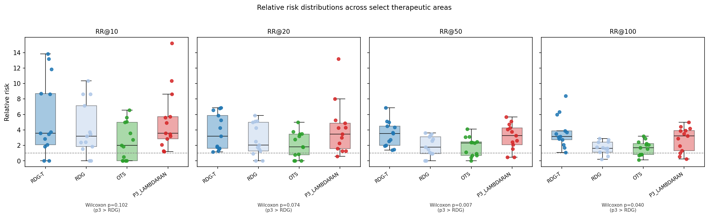
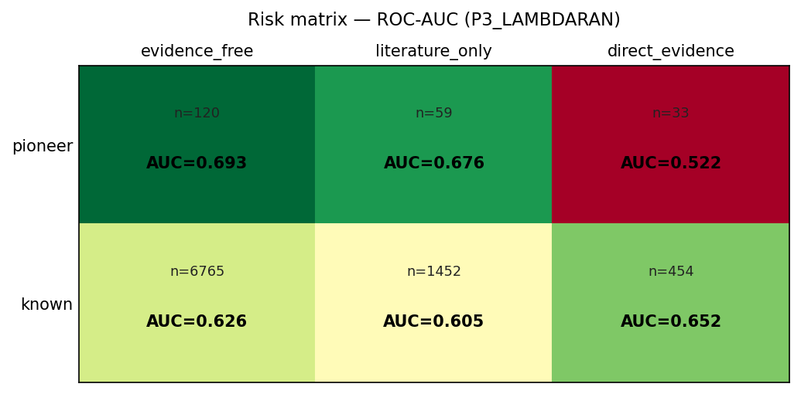

# Advancement Prediction — Benchmark Results

Benchmark of scoring methods on the clinical-advancement prediction task, evaluated on held-out test pairs. The headline comparison is **P3_LAMBDARAN (proposed)** vs. **RDG (time-agnostic baseline)**. OTS is included as an association-score baseline.

> **Note on RDG-T.** The time-aware relational distance baseline (`rdg__all__positive`) appears in the plots and tables but should be disregarded as a comparator: it leaks future information into its scores, so its apparent lead is not a fair reference. The discussion below focuses on RDG vs. P3_LAMBDARAN.

## Models compared

| Slug | Description |
| --- | --- |
| `OTS` | OpenTargets global association score (`ots__all`). Association baseline. |
| `RDG` | Time-agnostic relational distance / graph baseline (`rdg__no_time__positive`). **Primary reference.** |
| `P3_LAMBDARAN` | Proposed EA-HGT trained with LambdaRank loss (`p3_lambdarank`). **Proposed model.** |
| ~~`RDG-T`~~ | Time-aware RDG — *excluded from conclusions* due to label leakage. |

Strata:
- **Novelty**: `pioneer` (no prior T–D link) vs. `known`.
- **Evidence**: `direct_evidence`, `literature_only`, `evidence_free` at decision time.
- Combinations such as `known__literature_only` intersect the two axes.

## Overall classification performance

| Model | ROC-AUC | Average precision |
| --- | --- | --- |
| **P3_LAMBDARAN** | **≈0.63** | **≈0.12** |
| RDG | ≈0.64 | ≈0.11 |
| OTS | ≈0.49 | ≈0.09 |

P3_LAMBDARAN and RDG are roughly matched on global threshold-free metrics (P3 slightly higher AP, RDG slightly higher AUC). OTS performs at chance on this prospective split.

## Precision at top-N (relative risk vs. base rate)

Comparing P3_LAMBDARAN to RDG across top-N cutoffs:

| N | RDG RR | **P3 RR** | Δ (P3 − RDG) |
| --- | --- | --- | --- |
| 10  | 4.10 | **5.23** | +1.13 |
| 20  | 2.73 | **4.10** | +1.37 |
| 30  | 2.45 | **3.92** | +1.47 |
| 40  | 2.27 | **3.56** | +1.29 |
| 50  | 1.93 | **3.12** | +1.19 |
| 60  | 1.78 | **2.95** | +1.17 |
| 70  | 1.74 | **2.75** | +1.01 |
| 80  | 1.73 | **2.73** | +1.00 |
| 90  | 1.68 | **2.79** | +1.11 |
| 100 | 1.68 | **2.78** | +1.10 |

**P3_LAMBDARAN beats RDG at every top-N cutoff**, typically by RR ≈ +1.0 to +1.5. The enrichment at the top of the ranking (the regime that matters for triage) is substantial: P3 delivers ~5× the base rate at N=10 vs. ~4× for RDG, and the advantage is preserved as N grows.

## Relative risk by stratum

P3 vs. RDG by stratum (ignoring RDG-T):
- **`evidence_free` / `known__evidence_free`**: P3 roughly doubles RDG's RR at small N (e.g. RR@10 ≈ 2.64 vs. 0.22 on `evidence_free`; 4.21 vs. 0.34 on `known__evidence_free`). RDG has almost no signal where there is no prior evidence, while P3 does.
- **`known__literature_only`**: P3 dominates — RR@30 ≈ 6.89 (vs. RDG 1.64), RR@90 ≈ 6.52 (vs. RDG 1.12). The biggest P3-over-RDG gap.
- **`literature_only`**: P3 consistently 2–3× RDG across N.
- **`pioneer`**: noisy due to small support, but P3 shows strong enrichment at specific cutoffs (RR@60 ≈ 13.6).
- **`direct_evidence`**: the two models are close; this stratum is already easy because direct evidence is a strong signal on its own.

## Per-therapeutic-area performance

The delta heatmap (P3 minus RDG) is the direct per-TA view of the proposed-vs-baseline question:

- At **N=10**, P3 beats RDG in nearly every TA. Largest gains: **hematologic disease** (+15.3), **immune system disease** (+10.4), **endocrine system disease** (+8.6), **gastrointestinal disease** (+3.2).
- At **N=100**, P3 still leads in most TAs (+1 to +5 RR) but the gap narrows and flips in a few (e.g. respiratory/urinary marginal).
- Wilcoxon signed-rank test of per-TA RR (P3 vs. RDG):
  - N=10: p = 0.102
  - N=20: p = 0.074
  - **N=50: p = 0.007**
  - **N=100: p = 0.040**
  
  P3 is significantly better than RDG at deeper cutoffs; at N=10 the advantage is directionally consistent but not significant due to per-TA variance.

## Risk matrix — P3_LAMBDARAN across novelty × evidence

P3_LAMBDARAN ROC-AUC by cell:
- **pioneer × evidence_free** (n=120): **AUC = 0.693** — the model discriminates future advancements even with no prior evidence or prior T–D link, which is exactly where RDG has no signal (RR ≈ 0 at small N).
- **pioneer × literature_only** (n=59): AUC = 0.676.
- **pioneer × direct_evidence** (n=33): AUC = 0.522 — near chance, but the sample is small and direct evidence already saturates ranking.
- **known × {evidence_free, literature_only, direct_evidence}**: AUC 0.605–0.652 across the bulk (n ≈ 8.7k).

## Summary — P3_LAMBDARAN vs. RDG

1. **Global AUC/AP are comparable**, but P3 is **consistently and substantially better at the top of the ranking** — the regime that matters for prioritising T–D pairs.
2. **P3's biggest edge is where RDG has no signal**: `evidence_free` and `literature_only` pairs, both `known` and `pioneer`. Graph structure + temporally-valid training lets P3 score novel or evidence-poor pairs that RDG cannot separate.
3. **Per-TA**, P3 dominates RDG at N=10 in nearly all areas and is significantly better across TAs at N=50 and N=100 (Wilcoxon p < 0.05).
4. **Where P3 does not help over RDG**: `direct_evidence` pairs (evidence itself saturates ranking) and a handful of TAs at deep cutoffs.

## Source files

- Classification metrics: [classification_metrics.csv](classification_metrics.csv)
- RR by top-N / stratum: [relative_risk_by_limit.csv](relative_risk_by_limit.csv)
- RR per therapeutic area: [relative_risk_by_ta.csv](relative_risk_by_ta.csv)
- Test-pair strata: [test_pair_strata.csv](test_pair_strata.csv)
- Scored predictions: [predictions.csv](predictions.csv)
- Plots: [external_plots/](external_plots/)
- Cumulative advancement by TA (context): [cumulative_advancement_by_ta.csv](advancement_cumulative_output/cumulative_advancement_by_ta.csv)
