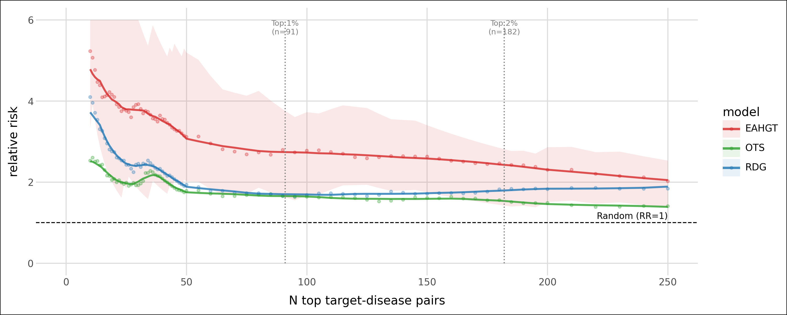
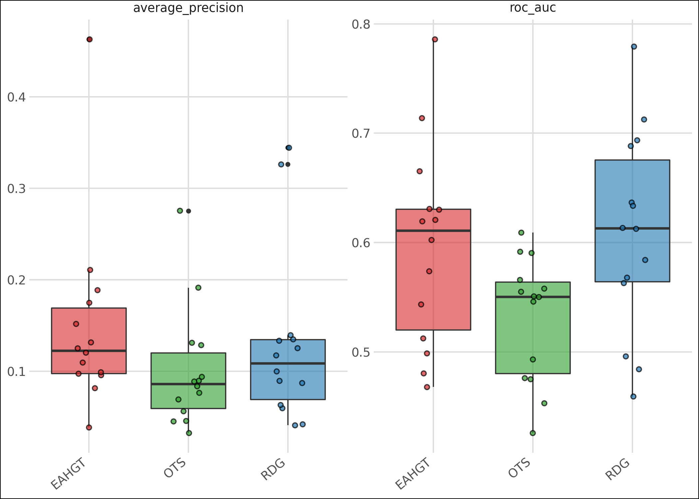
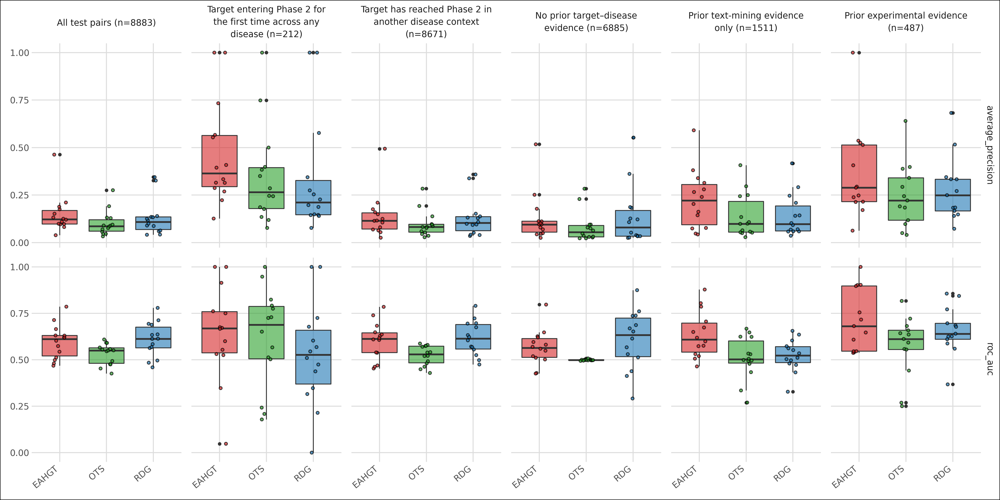
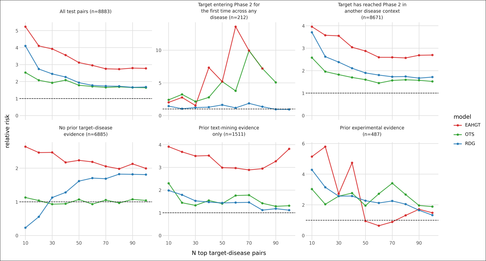
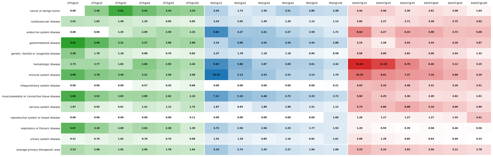
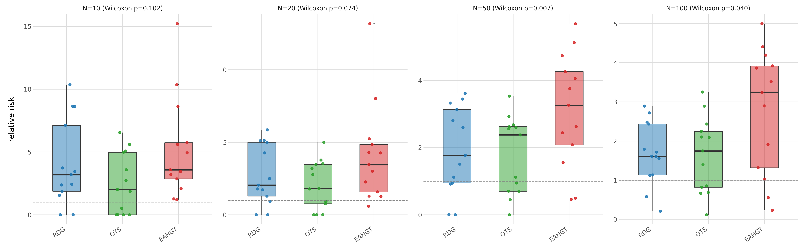

# Advancement Prediction — Benchmark Results

Benchmark of scoring methods on the clinical-advancement prediction task, evaluated on held-out test pairs. The evaluation follows the prospective temporal split design of Czech et al. (2024): models are trained on evidence available up to a decision year and evaluated on target–disease pairs that subsequently advanced from Phase 2 to Phase 3. The headline comparison is **EAHGT (proposed)** vs. **RDG (time-agnostic baseline)**. OTS is included as an association-score reference.

> **Data version.** All results in this snapshot are based on **OpenTargets release 23.06**. The full pipeline (edge collection → graph construction → node features → training → evaluation) is anchored at this release. Re-running against a later release (e.g. 25.06) may shift absolute RS values as evidence coverage evolves.

## Models compared

| Slug | Description |
| --- | --- |
| `OTS` | OpenTargets global association score (`ots__all`). Pre-computed association baseline that aggregates evidence across data sources without temporal awareness. |
| `RDG` | Constrained, L2-regularized linear regressor (Ridge) fit with all core features, excluding time since Phase 2 transition (`rdg__no_time__positive`). Represents the strongest published non-graph baseline from Czech et al. **Primary reference.** |
| `EAHGT` | Proposed Edge-Attributed Heterogeneous Graph Transformer trained with LambdaRank loss (`p3_lambdarank`). Encodes relational time via RTE edge features and is optimised directly for ranking rather than binary classification. **Proposed model.** |

Each model produces a score per target–disease pair; evaluation ranks pairs by score and measures enrichment of true advancements at the top of the list.

Strata used in sub-analyses:
- **Novelty**: `pioneer` (target has no prior Phase 2 entry in any disease at decision time) vs. `known` (target has reached Phase 2 in at least one other disease context).
- **Evidence density**: `direct_evidence` (experimental assay links), `literature_only` (text-mining only), `evidence_free` (no prior target–disease link at decision time).
- Combinations such as `pioneer__evidence_free` represent the hardest cases for ranking models.

---

## Precision at top-N (relative success vs. base rate)

**Relative success at N (RS@N)** is the primary evaluation metric following Czech et al. It measures how much more frequently true advancements appear in the top-N ranked pairs compared to the overall base rate:

$$\text{RS@N} = \frac{\text{positive rate among top-}N}{\text{positive rate among remaining pairs}}$$

A value of 1.0 means no enrichment above chance; higher is better. RS@N is preferred over threshold-free metrics (AUC, AP) for this task because it directly quantifies the practical value of ranking — a model that concentrates true advancements at the very top of the list is what matters for drug discovery triage. RS is computed as the mean across primary therapeutic areas (mean-of-ratios), matching the protocol in Czech et al.

The plot below shows the mean-of-ratios RS for all three models across N = 10 to 250. For EAHGT only, a 95% Katz log-method confidence interval is overlaid as a shaded band, derived from pooled counts across the full test set. The CI band reflects statistical uncertainty in the enrichment estimate — wide at small N (few pairs exposed) and narrowing as N grows. Vertical dotted lines mark the top 1% and top 2% of all test pairs, providing a scale reference for the regime where clinical triage decisions are typically made.

**Key observations:**
- EAHGT shows the highest RS across the full range of N, with the CI band lying entirely above the RDG line from N=10 onwards, indicating the advantage is statistically robust.
- All three models show declining RS as N grows, consistent with the enrichment being concentrated at the very top of the ranking — a property that directly reflects ranking quality.
- OTS performs comparably to RDG at small N but drops below at larger cutoffs, consistent with its lack of temporal calibration.

Comparing EAHGT to RDG at the cutoffs reported by Czech et al. (OpenTargets 23.06):

| N | RDG RS | **EAHGT RS** | Δ (EAHGT − RDG) |
| --- | --- | --- | --- |
| 10  | 4.10 | **5.23** | +1.13 |
| 20  | 2.73 | **4.10** | +1.37 |
| 30  | 2.45 | **3.92** | +1.47 |
| 40  | 2.27 | **3.56** | +1.29 |
| 50  | 1.93 | **3.12** | +1.19 |
| 60  | 1.78 | **2.95** | +1.17 |
| 70  | 1.74 | **2.75** | +1.01 |
| 80  | 1.73 | **2.73** | +1.00 |
| 90  | 1.68 | **2.79** | +1.11 |
| 100 | 1.68 | **2.78** | +1.10 |

EAHGT beats RDG at every cutoff, with the largest absolute advantage at N=30 (+1.47). The relative advantage is largest at small N, the regime of greatest practical relevance for triage. Even at N=100 — spanning a wide fraction of the test set — EAHGT maintains a +1.10 advantage, demonstrating that the improvement is not confined to the very tip of the ranking.

---

## Classification metrics (threshold-free)

The boxplots below show ROC-AUC and average precision per primary therapeutic area, providing a complementary threshold-free view of discrimination. Unlike RS@N, these metrics summarise performance across all possible thresholds and are less sensitive to ranking at the very top.

**Key observations:**
- EAHGT and RDG are broadly comparable on ROC-AUC (≈0.63 vs. ≈0.64), confirming that the graph model does not sacrifice global discrimination for top-of-list precision.
- EAHGT shows modestly higher average precision in most TAs, consistent with better concentration of true positives near the top of the ranking.
- OTS falls substantially below both on AP (≈0.09 vs. ≈0.11–0.12), reflecting the absence of temporal calibration.
- There is meaningful heterogeneity across TAs: some areas (e.g. oncology) show strong discrimination for all models while others (e.g. musculoskeletal) are harder across the board.

The stratified view below breaks classification metrics down by both stratum (pioneer/known, evidence density) and therapeutic area, revealing where the EAHGT advantage is concentrated.

**Key observations:**
- The EAHGT advantage on AP is most pronounced in the `evidence_free` and `literature_only` strata, particularly for `pioneer` targets — cases where RDG has minimal signal and the graph must fill the gap.
- In the `direct_evidence` stratum, all models perform similarly or RDG leads slightly, consistent with the evidence itself being a near-sufficient ranking signal.
- The `known` × `direct_evidence` intersection is the easiest subpopulation for all models; `pioneer` × `evidence_free` is the hardest.

---

## Relative success by stratum

The line plot below shows RS@N curves broken out by each stratum, allowing direct comparison of where EAHGT gains and loses relative to RDG as a function of cutoff.

**Key observations:**
- **Evidence-free**: The most striking separation. EAHGT achieves RS@10 ≈ 2.6 while RDG is near 0.2 — essentially no signal. The heterogeneous graph structure, which encodes multi-hop biological relationships, provides ranking signal in the complete absence of direct target–disease links that RDG relies on.
- **Literature only**: EAHGT is 2–3× RDG across the full N range. Text-mining evidence exists but is weak; graph topology augments it substantially.
- **Direct evidence**: The gap narrows sharply. Both models rank well (high RS at small N) but the direct evidence features are dominant, leaving little room for graph-derived signal to add value.
- **Pioneer targets**: High variance due to small support. EAHGT shows bursts of high RS at specific cutoffs but the curves are noisy — the small number of pioneer test pairs limits statistical reliability per stratum.
- **Known targets**: Both models perform well and the curves track more closely. EAHGT maintains a modest consistent advantage.

---

## Per-therapeutic-area relative success

The heatmap below shows RS at N = 10, 20, 30, 40, 50 and 100 for OTS, RDG and EAHGT, with one row per primary therapeutic area plus an average row. Colour intensity within each model group encodes relative performance — darker cells indicate higher RS within that model's range.

**Key observations:**
- EAHGT consistently shows the deepest colour (highest RS) at small N across nearly all TAs, confirming broad generalisation rather than dominance in a single area.
- At N=10, several TAs show EAHGT RS > 6 (hematologic, immune system, endocrine), suggesting particularly strong graph signal in these areas — likely driven by dense multi-hop evidence networks.
- RDG achieves competitive colour at larger N, reflecting that its linear features remain informative at wider cutoffs even when the graph adds less marginal value.
- OTS shows moderate RS in oncology and cardiovascular but falls behind in disease areas with sparser direct evidence, consistent with its association-score design.

---

## Distribution of per-TA relative success

The boxplots below show the distribution of per-TA RS values at N = 10, 20, 50 and 100. Each dot is one primary therapeutic area; the box shows median and IQR. The Wilcoxon signed-rank p-value in each panel title tests whether EAHGT RS is significantly greater than RDG RS across TAs (one-sided, paired by TA).

**Key observations:**
- At N=10 and N=20 the EAHGT distribution is clearly shifted upward but variance is high — a small number of TAs with low RS for EAHGT (or high RS for RDG) prevent significance (p=0.102, p=0.074).
- At N=50 and N=100 the advantage becomes consistent enough across TAs to reach statistical significance (p=0.007, p=0.040). This reflects that at wider cutoffs the ranking advantage is spread across more pairs per TA, reducing the influence of individual TA outliers.
- OTS shows the widest spread at small N — it performs well in a few TAs but poorly in others — whereas EAHGT and RDG are more consistent.
- The median EAHGT RS is above RDG in all four panels, with no reversal of the direction of the effect.

---

## Summary — EAHGT vs. RDG (OpenTargets 23.06)

1. **Ranking precision is substantially higher for EAHGT across all top-N cutoffs.** The advantage of +1.0 to +1.5 RS units is consistent from N=10 to N=100, statistically supported by the 95% Katz CI band, and not explained by differences in global AUC/AP.

2. **The graph provides signal where linear models cannot.** EAHGT's largest gains occur in `evidence_free` and `literature_only` pairs — cases where RDG's feature set carries little discriminative information. Multi-hop graph relationships allow the model to rank these pairs meaningfully.

3. **Generalisation is broad, not narrow.** EAHGT leads RDG in nearly all primary therapeutic areas at N=10, and the per-TA advantage reaches statistical significance at N=50 and N=100 (Wilcoxon p < 0.05). This rules out the possibility that the headline result is driven by a single TA.

4. **Limitations.** The improvement is smallest for `direct_evidence` pairs, where the label is largely predictable from existing evidence regardless of model architecture. Pioneer targets with no prior Phase 2 history show high variance, and the small stratum size limits conclusions. All results are on 23.06 data; the magnitude of the advantage should be re-confirmed on a more recent OpenTargets release.

---

## TODO

- **Update to OpenTargets 25.06** — all data, graph, and RDG comparison scores are currently anchored at the 23.06 release. Re-run the full pipeline (edge collection → graph construction → node features → training → evaluation) against the latest 25.06 snapshot to ensure results reflect current biology coverage and evidence.

- **Temporal GNN methods** — explore architectures designed for temporal graphs (e.g. TGN, CAWN, GraphMixer) as alternatives or complements to the static EA-HGT. These methods process edge timestamps natively rather than encoding recency as a feature, which may better capture the sequential nature of clinical evidence accumulation.

- **Ablation study** — systematically remove components of EA-HGT to isolate their contributions: edge attributes (score, novelty), RTE (relational time encoding), LambdaRank loss vs. BCE, and graph heterogeneity. Compare against the existing b1–b5 and p1–p3 baselines.

- **Hypothesis: transition-year-relative advancement edges** — currently all advancement edges are treated uniformly regardless of when the Phase 1→2 transition occurred. The hypothesis is that edges from more recent years carry different predictive signal than older ones. This could be modelled by weighting or filtering advancement edges by their recency relative to the decision year, or by adding a transition-age feature to the edge attributes.
